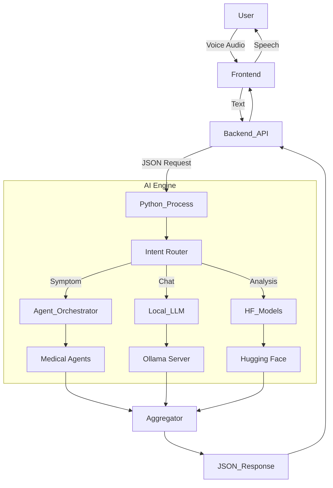

# CuraVox: AI Integration & Workflow Guide

## 1. How to Use CuraVox (User Manual)

### 1.1. Voice Interaction (The "Vox" Interface)
The app is designed to be **Talked To**, not just clicked.
- **Wake Words**: There is no specific wake word like "Alexa". Instead, the app continuously listens when you are on a compatible page (indicated by the microphone icon).
- **Global Commands**:
    - **"Go to [Page]"**: Navigates the app. Try: *"Go to scan"*, *"Go to home"*, *"Go to reminders"*.
    - **"Read this"**: Uses Text-to-Speech to read the current page's content (vital for blind users).
    - **"Help"**: Lists available commands.

### 1.2. Medicine Analysis (The "Cura" Interface)
1.  Navigate to the **Scan Page**.
2.  Hold a medicine bottle or strip/blister pack up to the camera.
3.  Say **"Capture Image"** or tap the screen.
4.  **Result**: The AI will announce:
    - **Name**: "Detected Paracetamol"
    - **dosage**: "500 mg"
    - **Instructions**: "Commonly used for fever and mild pain. Take as prescribed."

### 1.3. Symptom Checker
- Navigate to the **Home Dashboard**.
- Say: *"I have a headache and I feel dizzy."*
- **Result**: The Multi-Agent AI will analyze these symptoms against its internal knowledge base and offer non-medical advice or a "Consult a Doctor" warning.

---

## 2. Developer Guide: How to Work With It

### 2.1. Project Structure
The project is a **Monorepo** with three main moving parts:
- `frontend_app/`: React UI.
- `backend_api/`: Node.js API Server.
- `ai_ml_engine/`: Python AI Core.

### 2.2. Running Locally (Without Docker)
If you want to modify code, running natively is faster than rebuilding Docker containers.

1.  **Start AI Engine (Mental Check)**:
    - Ensure your Python virtual environment is active.
    - Ensure **Ollama** is running in the background (`ollama serve`).
    - *Note*: You don't need to manually run the python script; the backend will spawn it.

2.  **Start Backend**:
    ```bash
    cd backend_api
    npm install
    npm run dev
    # Runs on http://localhost:5000
    ```

3.  **Start Frontend**:
    ```bash
    cd frontend_app
    npm install
    npm run dev
    # Runs on http://localhost:3000
    ```

### 2.3. Debugging AI
The backend logs the output of the Python process.
- **Success**: You will see JSON objects printed in the terminal.
- **Failure**: Look for `stderr` outputs in the Node.js console. Common errors include missing Python packages or Ollama connection refused.

---

## 3. Creating Intelligence: How the Models Work

The system uses a **Hybrid AI Architecture**. It doesn't rely on just one model.

## 🧠 1. Hybrid AI Architecture (Dr. CuraVox)

The system now uses a **Smart Hybrid Approach** to ensure maximum accuracy and reliability:

### A. Primary Brain: Google Gemini 2.5 Flash
*   **Role**: Senior Clinical Pharmacist & Internal Medicine Specialist.
*   **Capabilities**:
    *   **Visual Analysis**: Reads medicine strips (OCR) + Identifies pills by shape/color.
    *   **Clinical Insight**: Generates "Doctor's Advice" and structured safety warnings.
    *   **High Performance**: <1s response time for complex queries.
*   **Safety**: Auto-switches to `gemini-1.5-flash` if the main model is overloaded (503 Error).

### B. Emergency Backup: Local Python Engine
*   **Role**: Offline Fallback & Privacy-First Processing.
*   **Triggers**: Activates automatically if Internet fails or Cloud API is down.
*   **Tech Stack**: Tesseract OCR (Multi-Angle) + MedLLaMA2 (Local LLM).

---

## 🔑 2. Environment Setup

To run this system, you must configure the backend environment.

### Required Variables
Create a `.env` file in `backend_api/` (see `.env.example`):

```env
# Core
PORT=5000
MONGODB_URI=mongodb://localhost:27017/medical_ai

# Security
JWT_SECRET=your_secret_key

# AI Configuration
GEMINI_API_KEY=AIzaSy... (Get from Google AI Studio)
```

> **Note**: The `.env` file is git-ignored for security. Do not commit your real keys.

---
### 3.2. Agentic Framework (The "Experts")
- **Role**: Symptom Diagnosis & Triage.
- **Where**: `ai_ml_engine/medical_agents.py`
- **Components**:
    - **Orchestrator**: The "Head of Department". Receives the patient case.
    - **Specialized Agents** (Cardio, Neuro, GP): Python classes that simulate specific reasoning.
- **Workflow**:
    1.  User input ("Chest pain") flows to the Orchestrator.
    2.  Orchestrator sends it to **all** agents.
    3.  **CardiologyAgent** sees "Chest pain" -> Weights it high -> Returns `CONFIDENCE: 0.9`.
    4.  **NeurologyAgent** sees "Chest pain" -> Weights it low -> Returns `CONFIDENCE: 0.1`.
    5.  Orchestrator picks the highest confidence result.

### 3.3. Hugging Face Transformers (Specific Tasks)
- **Role**: Precision NLP.
- **Where**: `ai_ml_engine/advanced_ai.py`
- **Why?**: LLMs can hallucinate. Transformers are strictly trained for specific tasks.
- **Models**:
    - **`dslim/bert-base-NER`**: Named Entity Recognition. Extracts "Aspirin" from "I took Aspirin".
    - **`deepset/roberta-base-squad2`**: Question Answering. Given a long text (drug leaflet), it finds the *exact* span of text answering "What is the dosage?".
    - **`facebook/bart-large-cnn`**: Summarization. Compresses long patient histories.

### 3.4. Execution Flow Diagram


