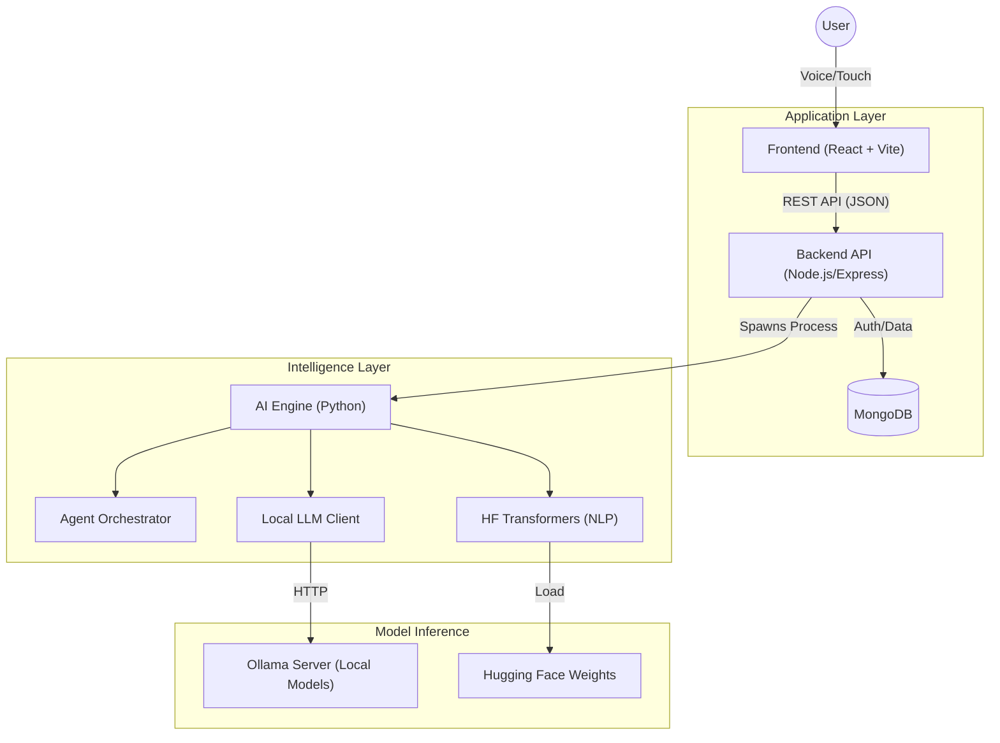

# CuraVox: Master System Architecture & Technical Overview

## 1. Executive Summary
This document provides a comprehensive technical deep-dive into **CuraVox**. It details how the Frontend, Backend, and AI Engine collaborate to provide features like **Voice-Guided Navigation**, **Medicine OCR Analysis**, **Symptom Checking**, and **Personalized Health Advice**.

---

## 2. High-Level Architecture
The system follows a **Microservices-inspired Monolith** pattern, containerized via Docker.

---

## 3. Component Details & "How It Works"

### 3.1. Frontend (The Interface)
- **Tech Stack**: React 18, Vite, Context API.
- **Key Service**: `VoiceService` (`frontend_app/src/services/voiceService.js`).
    - **How it works**: Uses the **Web Speech API** to listen for wake words ("Go to scan", "Tell me about X"). It decouples voice logic from UI components using a custom Event Bus (`window.dispatchEvent`), ensuring the UI stays responsive while listening.
- **Accessibility**: Designed for blind users with ARIA Live Regions and high-contrast visuals.

### 3.2. Backend (The Coordinator)
- **Tech Stack**: Node.js, Express, Mongoose.
- **Key Service**: `AdvancedMedicalAI` (`backend_api/services/aiService.js`).
    - **How it works**: Acts as a **Foreign Function Interface (FFI)**. When the frontend requests an AI task:
        1. Node.js writes request data to a temporary JSON file (`/tmp/input_uuid.json`).
        2. Spawns a Python child process: `python medical_ai_core.py --input temp.json`.
        3. Python runs the inference and prints JSON to `stdout`.
        4. Node.js captures `stdout`, parses the JSON, and sends it back to the frontend.
    - **Why this way?**: Python is king for AI, but Node.js is superior for I/O-bound web servers. This hybrid approach gets the best of both worlds.

### 3.3. AI Engine (The Brain)
- **Tech Stack**: Python 3.9+, PyTorch, Transformers, Ollama.
- **Core Module**: `medical_ai_core.py` & `advanced_ai.py`.
- **Architecture**:
    - **Hybrid Intelligence**: Combines **Rule-Based Agents** (fast, safe) with **Generative LLMs** (creative, flexible).

#### **List of AI Models Used**

| Category | Model Name / ID | Library | Purpose |
| :--- | :--- | :--- | :--- |
| **Generative LLM** | `llama3.2:latest` `medllama2` `mistral` | **Ollama** | Generating conversational medical advice, explaining complex terms, and providing empathy. The system *dynamically* selects the best available model. |
| **Question Answering** | `deepset/roberta-base-squad2` | **Hugging Face** | Extractive QA. Used to find precise answers (like "30mg") from a long context (e.g., a drug leaflet) without hallucination. |
| **Summarization** | `facebook/bart-large-cnn` | **Hugging Face** | summarizing long patient histories or medical articles into concise bullet points. |
| **Entity Recognition** | `dslim/bert-base-NER` | **Hugging Face** | Extracting specific medical terms (Drug Names, Diseases, Symptoms) from user voice commands to route them to the correct agent. |

---

## 4. Detailed Workflows

### 4.1. Voice Command Workflow ("Tell me about Paracetamol")
1.  **Microphone**: `VoiceService` captures audio -> converts to text "Tell me about Paracetamol".
2.  **Intent Analysis** (`advanced_ai.py`):
    - The `AdvancedMedicalAI` class uses regex/NLP to identify intent: `MEDICINE_QUERY`.
    - Extracts entity: `Paracetamol`.
3.  **Knowledge Retrieval**:
    - Checks **Local Knowledge Base** (dictionary of common drugs) for instant results.
    - If missing, queries **Ollama (LLM)**: "Explain Paracetamol briefly."
4.  **Response**: Text is sent back to Frontend -> `speechSynthesis` reads it aloud.

### 4.2. Image Scanning Workflow (OCR)
1.  **Capture**: User takes a photo of a pill bottle.
2.  **Upload**: Image is sent to `POST /api/ocr/process`.
3.  **Initial OCR**: Tesseract (via `tesseract.js` or backend equivalent) extracts raw text.
4.  **Optimization** (`inference/optimized_medicine_analyzer.py`):
    - **Regex Layer**: A fast pass extracts likely dosages ("500mg") and forms ("Tablet").
    - **Correction**: If OCR reads "Parac3tamol", fuzzy matching corrects it to "Paracetamol".
5.  **Data Structuring**: The system builds a structured `MedicineInfo` object and saves it to the user's history.

### 4.3. Symptom Checking Workflow (Multi-Agent)
1.  **Input**: User says "I have chest pain and shortness of breath."
2.  **Orchestration** (`medical_agents.py`):
    - `MedicalAgentOrchestrator` receives the symptoms.
    - It distributes them to: `CardiologyAgent`, `NeurologyAgent`, `GeneralPracticeAgent`.
3.  **Agent Reasoning**:
    - **CardiologyAgent**: Sees "Chest Pain" + "Breath" -> High Confidence (0.95) for Cardiac Issue.
    - **NeurologyAgent**: Sees no neuro symptoms -> Low Confidence.
4.  **Consensus**: The Orchestrator picks the Cardiology result as primary and flags "URGENT".
5.  **Output**: Returns: "Possible Cardiac Event. Please seek emergency care immediately."

---

## 5. Security & Safety Mechanisms
- **FFI Isolation**: The Python process is spawned ephemerally and killed immediately after use, preventing memory leaks or state pollution.
- **Panic Button**: The `VoiceService` has hardcoded "Help" or "Call 911" triggers that bypass all AI processing for instant response.
- **Refusal to Diagnose**: The AI is programmed with a system prompt that forces it to append "I am an AI, not a doctor" disclaimers to all generative advice.
