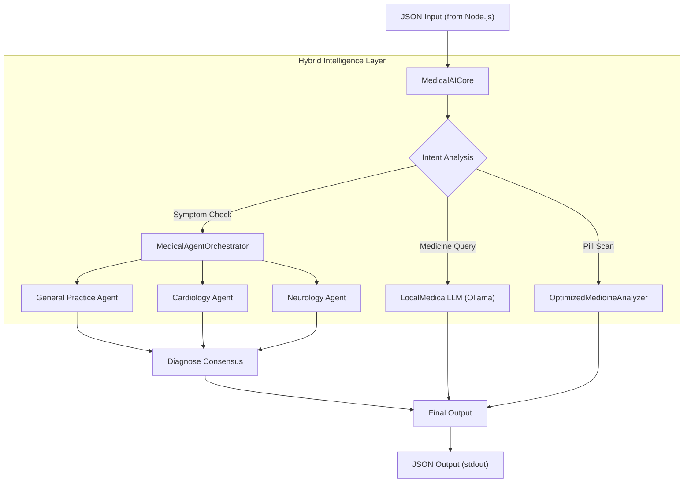

# AI/ML Engine: Comprehensive Documentation

## 1. System Overview
The **AI/ML Engine** is the intelligence core of the Medical AI Assistant. It is a hybrid system that combines **Deterministic Rule-Based Agents** (for safety and specific medical protocols) with **Generative Local LLMs** (for natural language understanding and empathy).

### Architecture Diagram

---

## 2. Integrated AI Models
We use a suite of models optimized for local execution and privacy.

| Component | Model / Technology | Purpose |
| :--- | :--- | :--- |
| **Generative AI** | `llama3.2:latest` `mistral:latest` | General medical advice, explaining terms, and conversational empathy. |
| **Medical QA** | `deepset/roberta-base-squad2` | Extractive Question Answering (finding strict answers in drug leaflets). |
| **NER** | `dslim/bert-base-NER` | Named Entity Recognition (Extracting drug names/symptoms from voice). |
| **Summarization**| `facebook/bart-large-cnn` | Summarizing long patient histories. |
| **Vision/OCR** | Tesseract + Regex | Extracting text from medicine bottles (Hybrid Code/AI). |

---

## 3. Core Components

### 3.1. `MedicalAICore` (Central Controller)
- **File**: `medical_ai_core.py`
- **Role**: The main entry point. It initializes all sub-systems, handles command-line arguments (from the Node.js backend), and routes requests to the correct module.
- **Key Logic**:
    - **Caching**: Checks `caching_system` before running expensive inferences.
    - **Fallback**: If the LLM is offline, it switches to "Safe Mode" (keyword-based responses only).

### 3.2. `MedicalAgentOrchestrator` (Expert System)
- **File**: `medical_agents.py`
- **Role**: Simulates a panel of doctors.
- **How it works**:
    - Receives a list of symptoms.
    - **Parallel Consultation**: Asks the `CardiologyAgent`, `NeurologyAgent`, `PediatricAgent`, and `GeneralPracticeAgent` for their opinions.
    - **Consensus**: If the Cardiologist is 95% confident it's a heart attack, but the GP is only 20% confident it's indigestion, the system flags it as **URGENT** and outputs the Cardiologist's warning.

### 3.3. `LocalMedicalLLM` (Generative AI)
- **File**: `local_llm_integration.py`
- **Role**: Manages the connection to Ollama.
- **Features**:
    - **Auto-Discovery**: Scans the user's installed Ollama models and picks the best one (preferring `medllama2` if available).
    - **Prompt Engineering**: Wraps user queries in a strict system prompt ("You are a medical assistant... do not hallucinate...").

### 3.4. `AdvancedMedicalAI` (NLP Pipeline)
- **File**: `advanced_ai.py`
- **Role**: The "High-Level" thinker.
- **Features**:
    - **Intent Classification**: Decides if "My head hurts" is a `SYMPTOM_CHECK` or a `GENERAL_QUERY`.
    - **Hugging Face Integration**: Loads the BERT/RoBERTa models for specific NLP tasks that don't require a full LLM.

### 3.5. `OptimizedMedicineAnalyzer` (Inference)
- **File**: `inference/optimized_medicine_analyzer.py`
- **Role**: High-speed text analysis.
- **Optimization**: Uses pre-compiled Regex patterns to extract dosages (`500mg`, `10ml`) and forms (`Tablet`, `Capsule`) in microseconds, reserving the LLM only for interpreting complex side-effect warnings.

---

## 4. Data Flow & Inter-Process Communication (IPC)
Since this engine runs in Python but the backend is Node.js, we use a file-based IPC mechanism:

1.  **Node.js**: Writes `input.json` -> `{ "action": "analyze_symptoms", "symptoms": ["chest pain"] }`.
2.  **Spawn**: Node.js calls `python medical_ai_core.py --input input.json`.
3.  **Python**:
    - Reads `input.json`.
    - Runs the Agents.
    - Prints result JSON to `stdout`.
4.  **Node.js**: Captures `stdout`, parses it, and deletes `input.json`.

## 5. Caching Strategy
- **File**: `caching_system.py`
- **Mechanism**: Thread-safe LRU (Least Recently Used) Cache.
- **TTLs**:
    - **Medicine Info**: 2 hours (Static data).
    - **OCR Results**: 30 mins.
    - **diagnoses**: 1 hour.
