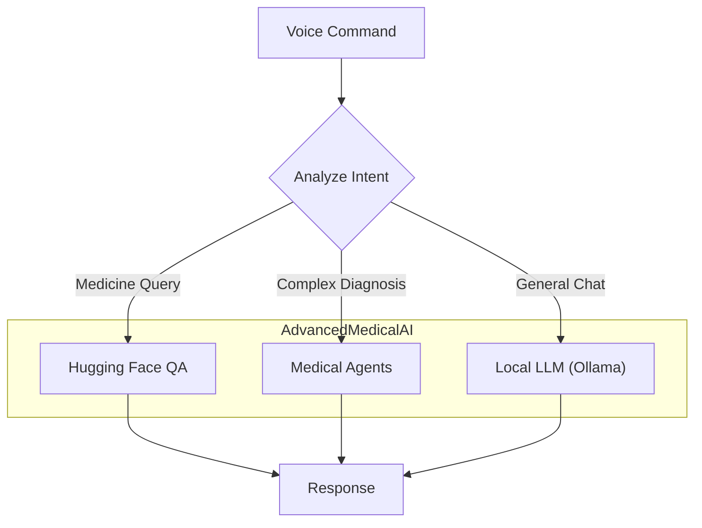

# Documentation: `advanced_ai.py`

## Overview
This module acts as the **Integrated Intelligence Layer**, combining traditional NLP models (via Hugging Face Transformers) with the Agentic capabilities of `MedicalAICore`. It serves as the primary controller for "Smart" features like voice command processing, intent recognition, and multi-model orchestration.

## Code Block Explanation

### `AdvancedMedicalAI` Class
- **Purpose**: A facade that unifies Local LLMs, Agentic workflows, and Specialized NLP Pipelines into a single interface.
- **Key Components**:
  - `self.local_llm`: Link to Ollama (via `LocalMedicalLLM`).
  - `self.agent_orchestrator`: Link to the Multi-Agent System (`MedicalAgentOrchestrator`).
  - `self.qa_pipeline`: Hugging Face `roberta-base-squad2` for specific Q&A.
  - `self.summarizer`: Hugging Face `bart-large-cnn`.
  - `self.nlp_pipeline`: Hugging Face `bert-base-NER` for extracting medical terms.

### `process_voice_command(user_id, command)`
- **Intent Analysis**: Uses keyword matching (lines 314-317) to classify commands into intents like `medicine_info`, `side_effects`, `interaction_check`, etc.
- **Routing**: Dispatches the command to specific handlers (e.g., `_handle_interaction_check`, `_handle_warnings_request`).

### `_initialize_models()`
- **Hugging Face Integration**: Attempts to load Transformer pipelines. If loading fails (e.g., no internet or missing model files), it gracefully falls back to `None`, printing an error to the logs.
- **User Note**: When running the backend, look for "Advanced AI models initialized successfully" in the logs to confirm Hugging Face models are active.

## Flowchart

## How It Works & Links
- **Links**:
    - **Ollama**: via `local_llm_integration.py`
    - **Medical Agents**: via `medical_agents.py`
    - **Core**: via `medical_ai_core.py`
- **Optimization**:
    - **Local Knowledge Base**: Contains a hardcoded dictionary (`_initialize_local_medical_knowledge`) for instant lookup of common drugs (Paracetamol, Ibuprofen) without needing an LLM call, reducing latency for common queries.
    - **Cache**: Uses `cache_manager` to store results of expensive agent queries.
