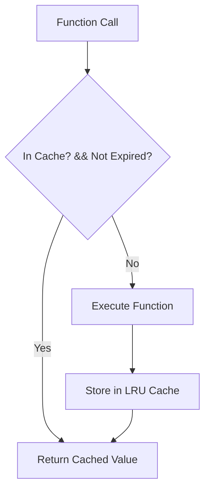

# Documentation: `caching_system.py`

## Overview
This module implements a multi-strategy caching layer to optimize the performance of the AI engine. Since LLM inference and agent reasoning can be slow (seconds), caching is critical for a responsive user experience.

## Code Block Explanation

### `LRUCache` Class
- **Implementation**: A thread-safe Least Recently Used (LRU) cache.
- **Mechanism**:
    - Keeps track of access times.
    - Evicts the oldest items when `capacity` is reached.
    - Respects `ttl` (Time To Live); expired items are removed on access.
- **Thread Safety**: Uses `threading.Lock()` to ensure safe concurrent access from the Node.js backend (if accessed via multi-threaded Python server wrappers or future expansions).

### `MedicalCacheManager` Class
- **Segmentation**:Maintains separate caches for different data types to prevent one type (e.g., OCR images) from evicting another (e.g., Medicine Info).
    - `medicine_cache`: TTL 2 hours.
    - `ocr_cache`: TTL 30 mins.
    - `llm_cache`: TTL 1 hour.
    - `agent_cache`: TTL 1 hour.
    - `user_context_cache`: TTL 4 hours.

### `cache_memoize` Decorator
- **Usage**: Can be applied to any function ` @cache_memoize(ttl=60)`.
- **Logic**: Automatically generates a unique cache key based on function arguments and checks the cache before executing the function.

## Flowchart

## Optimization
- **Key Hashing**: Uses `hashlib.sha256` to generate consistent string keys from complex objects (like dictionaries or lists) passed as arguments.
- **Granular TTL**: Different data types have different expiration times based on how frequently they change (e.g., Medicine info changes rarely, so it has a long TTL).
