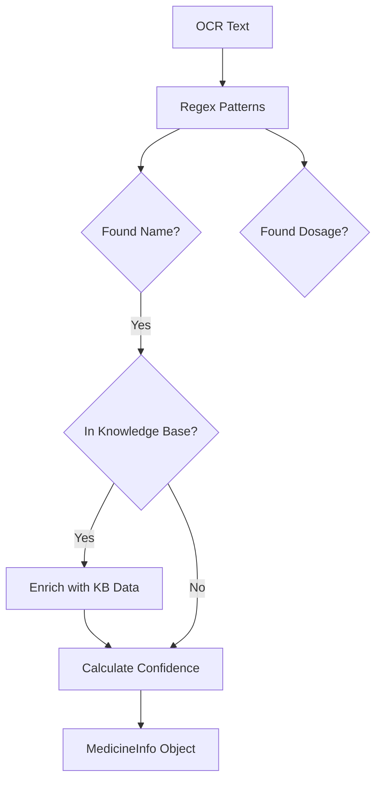

# Documentation: `inference/optimized_medicine_analyzer.py`

## Overview
This module helps extract structured information from unstructured text (like OCR output). It uses Regex (Regular Expressions) extensively as a fast, deterministic first pass before falling back to heavier AI models if needed.

## Code Block Explanation

### `OptimizedMedicineAnalyzer` Class
- **Regex Compilation**: Compiles all regex patterns in `__init__` (`_compile_patterns`) for maximum performance (compiling regex is expensive, so we do it once).
- **Extraction Methods**:
    - `_extract_medicine_name`: Looks for capitalized words or matches against a known database.
    - `_extract_dosage_form`: Matches "tablet", "syrup", "capsule", etc.
    - `_extract_strength`: Matches "500mg", "10ml", etc.
    - `_calculate_confidence_score`: Heuristic scoring based on how many fields were successfully extracted (e.g., if Name + Dosage + Side Effects are found, confidence is high).

### `MedicineInfo` Dataclass
- **Structure**: A strictly typed container for the analysis result, ensuring consistent data shape for the frontend.

## Flowchart

## Optimization
- **Regex vs LLM**: Uses regex for 90% of the work. This is orders of magnitude faster (microseconds) than calling an LLM (seconds).
- **Knowledge Base Lookup**: Checks if the medicine is "known" (e.g., Paracetamol) and fills in missing gaps instantly from a dictionary, rather than trying to guess from the text.
