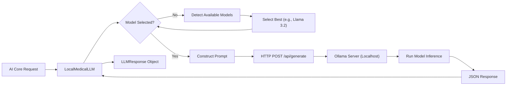

# Documentation: `local_llm_integration.py`

## Overview
This module handles all interactions with the **local Large Language Model (LLM)** via Ollama. It abstracts the HTTP requests, error handling, and model selection, providing a clean Python API for generating text.

## Code Block Explanation

### `LocalMedicalLLM` Class
The main interface for generative AI.

- **`__init__`**:
    - Connects to Ollama at `http://localhost:11434`.
    - **Auto-Detection**: Calls `_select_best_model` to pick the most capable model installed on the user's machine (e.g., `llama3.2`, `mistral`, `llama3.1`).

- **`_select_best_model`** (Crucial Logic):
    - Lists available models via Ollama API.
    - Iterates through a **Priority List**: `['llama2-medical', 'medllama2', 'llama3.2', 'mistral', ...]`.
    - Selects the first match. This ensures the system works out-of-the-box on various setups without manual config.

- **`generate_medical_response`**:
    - Constructs a **Context-Aware Prompt**: "You are an expert... Context: [Patient Info]... Question: [Query]".
    - Sends POST request to `/api/generate`.
    - **Safety Fallback**: Returns a pre-canned "Consult a doctor" message if the LLM is offline or errors out.
    - **Confidence Scoring**: Heuristically calculates confidence based on response length and processing time (`_calculate_confidence`).

- **Helper Methods**:
    - `analyze_drug_interactions`: Specialized prompt engineering for checking drug risks.
    - `provide_health_advice`: Generalized advice generation.
    - `check_connection`: "Ping" method to verify Ollama status.

## Flowchart

## Optimization & Robustness
- **Dynamic Model Selection**: This is the key optimization. Instead of failing if `llama2-medical` is missing, it adapts to whatever the user has (e.g., the powerful `llama3.2:latest`).
- **Timeouts**: Enforces a 30s timeout to prevent hanging the entire backend if the local inference is stuck.
- **Offline Mode**: If `check_connection` fails, it sets `self.connected = False` and returns safe fallbacks instantly, avoiding network lag.
