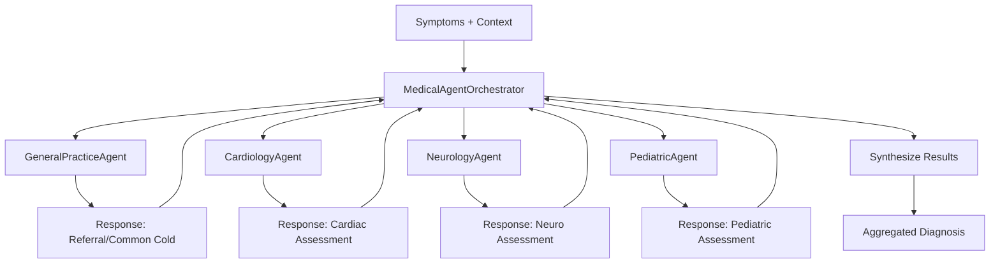

# Documentation: `medical_agents.py`

## Overview
This module implements a **multi-agent medical expert system**. It defines specialized "agents" that mimic the reasoning of doctors in different fields (Cardiology, Neurology, Pediatrics, General Practice). An orchestrator manages these agents, routing patient symptoms to the appropriate specialists and aggregating their diagnoses.

## Code Block Explanation

### 1. Core Abstractions
#### `MedicalAgent` (Abstract Base Class)
Defines the standard interface for all medical specialists.
- **Attributes**: `specialty`, `name`.
- **Abstract Methods**:
    - `diagnose(symptoms, context)`: Returns a diagnosis.
    - `provide_treatment_recommendation(diagnosis, context)`: Suggests treatments.
    - `handle_emergency(emergency_signs, context)`: Provides immediate protocol for critical situations.

#### `PatientContext` (Dataclass)
Standardizes the patient's background info (age, gender, history) to ensure agents make personalized decisions.

### 2. Specialized Agents
Each agent implements the abstract methods with domain-specific logic.

- **`GeneralPracticeAgent`**:
    - Acts as the first line of defense.
    - **Logic**: Identifies common ailments (flu, cold) and determines if a referral to a specialist (Cardiologist, Neurologist) is needed based on symptom keywords.

- **`CardiologyAgent`**:
    - **Expertise**: Heart-related conditions (MI, Heart Failure, Hypertension).
    - **Logic**: Weights symptoms like "chest pain" or "shortness of breath" heavily, especially if risk factors (smoking, existing hypertension) are present in the `PatientContext`.

- **`NeurologyAgent`**:
    - **Expertise**: Nervous system (Stroke, Seizures, Migraines).
    - **Logic**: Checks for "FAST" stroke indicators and seizure signs.

- **`PediatricAgent`**:
    - **Expertise**: Children's health.
    - **Logic**: **Age-Gating**: First checks if `context.age <= 18`. If not, it politely declines to diagnose. Calculates weight-based dosages for fever reducers.

### 3. `MedicalAgentOrchestrator`
The conductor of the system.
- **Role**: Manages the collection of agents.
- **`process_patient_input`**:
    - Sends symptoms to **all** initialized agents (or a relevant subset).
    - Aggregates their responses.
    - Calculates a "consensus" score.
    - Determines which agent's diagnosis is the "primary" one based on confidence levels.

## Flowchart

## How It Works & Links
- **Linked By**: `medical_ai_core.py` instantiates `MedicalAgentOrchestrator` and calls `process_patient_input`.
- **Optimizations**:
    - **Rule-Based Filtering**: Agents use keyword matching (e.g., `if "chest pain" in symptoms`) which is O(N) and extremely fast compared to LLM inference.
    - **Concurrency**: The design technically supports running agents in parallel threads (though currently synchronous in this implementation).

## Safety & Ethics
- **Emergency Protocols**: Each agent has a dedicated `handle_emergency` method that bypasses standard diagnosis to output immediate "Call 911" instructions if critical keywords are found.
- **Pediatric Safeguards**: Explicit checks prevent adult dosages being recommended to children.
