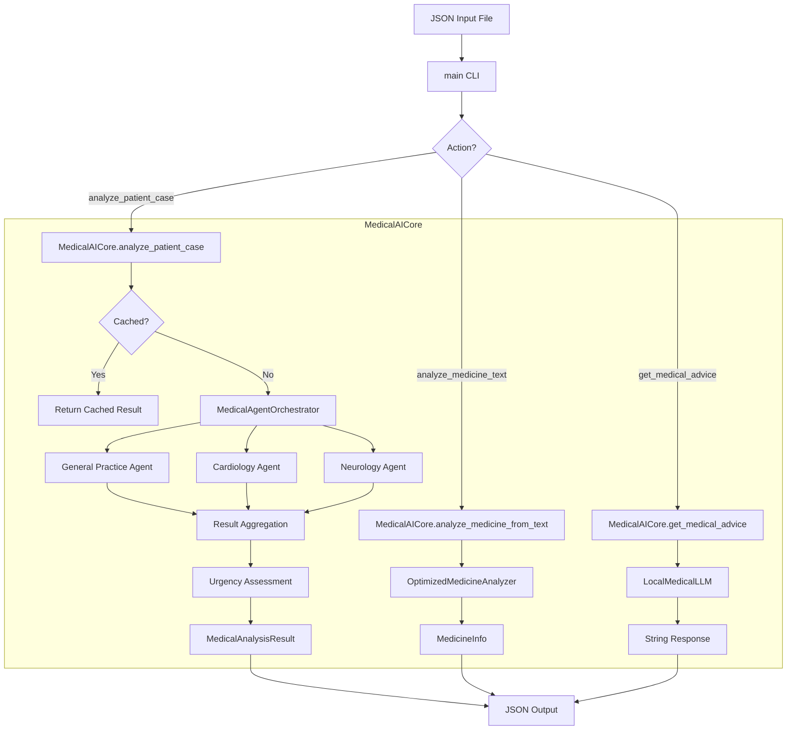

# Documentation: `medical_ai_core.py`

## Overview
`medical_ai_core.py` acts as the **central nervous system** of the AI engine. It orchestrates the interaction between various specialized components:
- **Medicine Analysis**: Identifying pills and reading prescription labels.
- **Medical Agents**: Simulating specialist doctors for diagnosis.
- **Local LLM**: Generating human-like medical advice and summaries locally.
- **Caching**: Optimizing performance by storing repeated query results.

This file provides the `MedicalAICore` class, which exposes high-level methods for patient analysis, medicine identification, and general medical advice. It also contains the `main` function, which serves as the **CLI entry point** used by the Node.js backend to communicate with the Python system.

## Code Block Explanation

### 1. Data Structures
#### `MedicalAnalysisResult` (Dataclass)
A structured container for the complete output of a patient case analysis. It standardizes the return format, ensuring consistent consumption by the backend.
- **Fields**: `patient_id`, `symptoms`, `primary_diagnosis`, `differential_diagnoses`, `treatment_recommendations`, `urgency_level`, `confidence_score`, etc.

### 2. `MedicalAICore` Class
The main controller class that initializes all subsystems.

- **`__init__`**:
    - Initializes `OptimizedMedicineAnalyzer`, `LocalMedicalLLM`, `MedicalAgentOrchestrator`, and `cache_manager`.
    - Checks for LLM availability to gracefully degrade if the model is offline.

- **`analyze_patient_case`**:
    - **Purpose**: Runs a full diagnostic workflow.
    - **Logic**:
        1.  **Cache Check**: Returns cached result if input is identical.
        2.  **Agent Orchestration**: Passes symptoms to `MedicalAgentOrchestrator`.
        3.  **Synthesis**: Aggregates agent results to determine `primary_diagnosis`, `differential_diagnoses`, and `treatment_recommendations`.
        4.  **Urgency Assessment**: Evaluates if the case is emergent using `_assess_urgency_level`.
        5.  **Confidence Calculation**: Computes a reliability score for the diagnosis.
        6.  **Caching**: Stores the final result.

- **`analyze_medicine_from_text`**:
    - **Purpose**: Extracts structured info (uses, side effects) from medicine names or OCR text.
    - **Logic**: Delegates to `medicine_analyzer` and caches the result.

- **`get_medical_advice`**:
    - **Purpose**: Handles free-form medical queries (e.g., "What is ibuprofen?").
    - **Logic**: Uses `LocalMedicalLLM` to generate a response, injecting `PatientContext` if available for personalization.

### 3. Helper Methods (Internal)
- **`_determine_primary_diagnosis`**: Selects the diagnosis from the agent with the highest confidence score.
- **`_generate_differential_diagnoses`**: Aggregates other potential diagnoses from all agents.
- **`_assess_urgency_level`**: Scans symptoms and agent warnings for keywords like "emergency", "chest pain", etc., to flag urgent cases.
- **`_calculate_overall_confidence`**: A weighted formula largely based on the highest agent confidence and the agreement between agents.

### 4. `main` Function (CLI)
The entry point for external calls.
- **Input**: Reads a JSON file path from the `--input` argument.
- **Routing**: Dispatches execution based on the `action` field in the JSON (`analyze_patient_case`, `analyze_medicine_text`, etc.).
- **Output**: Prints the final result as a JSON string to `stdout` for the Node.js backend to capture.

## Flowchart

## How It Works & Links
1.  **Node.js Integration**: The `backend_api` creates a temporary JSON file and executes this script via `spawn('python', ['medical_ai_core.py', '--input', 'temp.json'])`.
2.  **Dependencies**:
    - `inference/optimized_medicine_analyzer.py`: logic for medicine analysis.
    - `local_llm_integration.py`: logic for talking to Ollama.
    - `medical_agents.py`: logic for specific medical agents.
    - `caching_system.py`: shared caching logic.

## Optimization & Performance
- **Caching**: The `# Check cache first` step in every major method significantly reduces latency for repeated queries (e.g., repeatedly analyzing the same "Tylenol" image).
- **Graceful Degradation**: The system checks `llm_available` at startup. If the local LLM is down, it falls back to a safe "Consult a doctor" message instead of crashing.
- **Lazy Loading**: Imports are structured (standard `from ... import`) but the architecture supports independent scaling of components.
