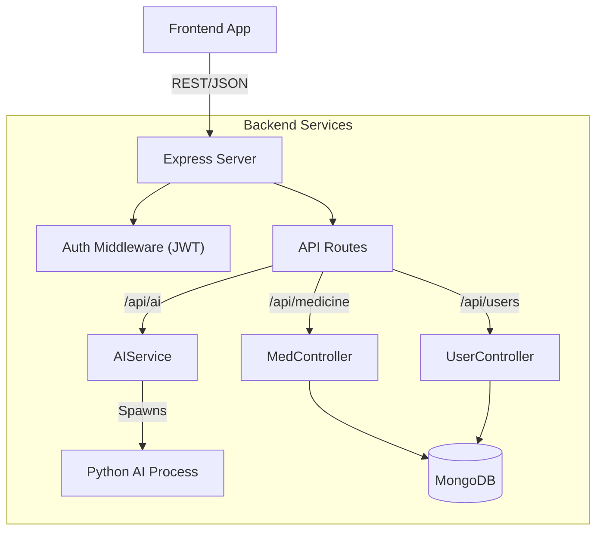

# Backend API: Comprehensive Documentation (CuraVox)

## 1. System Overview
The **Backend API** is the central nervous system of the application. It runs on **Node.js (v18)** with **Express** and handles:
- User Authentication (JWT).
- Database Management (MongoDB).
- Orchestration of the AI Engine (Python Bridge).
- Image Processing (OCR Uploads).

### Architecture Diagram

---

## 2. Key Components

### 2.1. `server.js` (Entry Point)
- **Role**: Initializes the Express app, connects to MongoDB, and mounts routes.
- **Middleware**:
    - `cors`: Allows cross-origin requests from the React frontend.
    - `helmet`: Sets security HTTP headers.
    - `express-rate-limit`: Prevents DDoS by limiting requests per IP.

### 2.2. `services/aiService.js` (The Bridge)
- **Role**: Manages communication with the Python AI Engine.
- **Mechanism**:
    - Takes a Javascript Object (e.g., `{ symptoms: [...] }`).
    - Serializes it to a temporary JSON file.
    - Executes `medical_ai_core.py`.
    - Parses the output and handles errors (e.g., if Python crashes).
- **Optimization**: Uses `uuid` for temp files to allow concurrent user requests without file collisions.

### 2.3. Models (Data Layer)
- **`User.js`**:
    - Fields: `email`, `password` (bcrypt hash), `medicalHistory`, `role` (admin/user).
    - Hooks: `pre('save')` automatically hashes passwords.
- **`Medicine.js`**:
    - Fields: `name`, `brandName`, `dosage`, `sideEffects`, `barcode`.
    - Indexing: Text indexes on `name` and `brandName` for fast search.
- **`OcrResult.js`**:
    - Stores the history of scanned images and the AI's confidence score for that scan.

---

## 3. API Routes

### 3.1. Authentication (`/api/auth`)
- `POST /register`: Creates a new user & JWT.
- `POST /login`: Validates credentials & returns JWT.
- `GET /me`: Returns the current user's profile (protected).

### 3.2. AI Operations (`/api/ai`)
- `POST /voice-command`: Processes natural language (e.g., "Check interactions for X and Y").
- `POST /medicine-analysis`: Analyzes OCR text or medicine names.
- `POST /symptom-checker`: Runs the Multi-Agent diagnosis system.

### 3.3. Medicine Catalog (`/api/medicine`)
- `GET /search/:term`: Fuzzy search for medicines.
- `POST /`: (Admin Only) Adds new medicines to the database.
- `POST /analyze-text`: Quick analysis endpoint for raw text.

### 3.4. OCR (`/api/ocr`)
- `POST /process`: Uploads an image -> Runs OCR -> Returns text & AI analysis.
- `GET /history`: Returns a user's past scans.

---

## 4. Security & Validation
- **Authentication**: Bearer Token (JWT) required for all non-public routes.
- **Input Validation**: `express-validator` is used on all POST/PUT routes to sanitize inputs (email format, password length) before they reach the controller.
- **Role-Based Access Control (RBAC)**: Middleware checks `req.user.role === 'admin'` for sensitive operations like deleting medicines.

## 5. Deployment
- **Docker**: The `Dockerfile.backend` installs both Node.js dependencies and the required Python runtime to ensure the AI bridge works in production.
- **Environment API**: Configured via `docker-compose.yml` (PORT=5000, MONGODB_URI=...).
