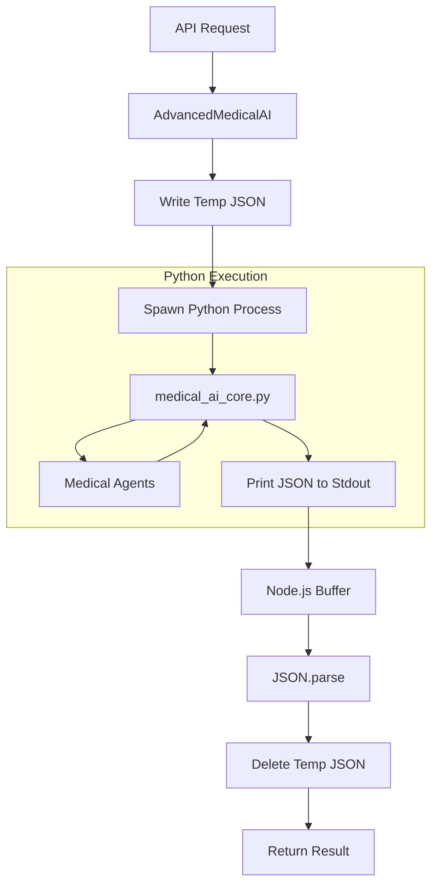

# Documentation: `aiService.js`

## Overview
This service component acts as the **Foreign Function Interface (FFI)** between the Node.js backend and the Python AI Core. Since the advanced medical logic resides in Python, this service manages the Inter-Process Communication (IPC).

## Code Block Explanation

### `AdvancedMedicalAI` Class

- **`constructor`**:
    - Defines the path to `medical_ai_core.py`.
    - Initializes availability flags.

- **`callPythonEngine(action, params)`** (The Core Mechanism):
    - **Purpose**: Executes the Python script with specific arguments.
    - **Mechanism**:
        1.  **Serialization**: Writes `action` and `params` to a temporary JSON file (`medical_ai_input_{uuid}.json`).
        2.  **Execution**: Spawns a child process: `python medical_ai_core.py --input [temp_file]`.
        3.  **Capture**: Listens to `stdout` for the result and `stderr` for errors.
        4.  **Deserialization**: Parses the last line of `stdout` as JSON.
        5.  **Cleanup**: Deletes the temporary file to prevent disk clutter.

- **High-Level Methods**:
    - `processComplexQuery`: Interfaces with the "Medical Advice" feature.
    - `performMedicineAnalysis`: Interfaces with the "OCR/Pill Co-pilot" feature.
    - `analyzeSymptoms`: Interfaces with the "Symptom Checker" feature.
    - `checkInteractions`: Interfaces with the "Drug Interaction" feature.

## Flowchart

## How It Works & Links
- **Links**:
    - Called by `controllers/aiController.js` (implied by routes).
    - Calls `ai_ml_engine/medical_ai_core.py`.
- **Optimization**:
    - **Asynchronous**: Uses `Promise` and event listeners (`on('data')`, `on('close')`) to avoid blocking the Node.js event loop while Python runs.
    - **UUIDs**: Uses `uuidv4` for temp files to prevent collisions in concurrent requests.

## Stability
- **Error Handling**: Wraps file operations in `try/catch`. Explicitly handles non-zero exit codes from Python.
- **Fail-Safe**: If the Python script crashes or produces invalid JSON, the service catches the error and rejects the promise cleanly, allowing the API to return a proper 500 error instead of hanging.
