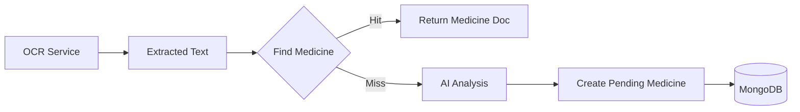

# Documentation: `models/Medicine.js`

## Overview
This model represents the **catalog of medicines** known to the system. It stores detailed pharmacological information used for the "Medicine Analysis" and "Pill Co-pilot" features.

## Code Block Explanation

### 1. Schema Definition
- **Core Info**: `medicineName` (indexed), `genericName`, `manufacturer`.
- **Physical Traits**: `dosageForm` (tablet, syrup), `strength` (500mg), `imageUrl`.
- **Clinical Info**: `uses`, `sideEffects`, `contraindications`, `warnings`.
- **Inventory/Retail**: `price`, `batchNumber`, `expiryDate`, `barcode` (sparse index).
- **OCR Integration**: `ocrText` (text extracted from packaging), `confidenceScore`.
- **Verification**: `approved` (boolean) to distinguish between AI-scraped data and pharmacist-verified data.

## Flowchart

## Optimization
- **Text Search**: Fields like `medicineName` and `genericName` are trimmed to ensure clean searchability.
- **Indexes**: `medicineName` is indexed for fast lookups. `barcode` has a `sparse` index, allowing many medicines to have no barcode without index bloat, while enforcing uniqueness for those that do.
