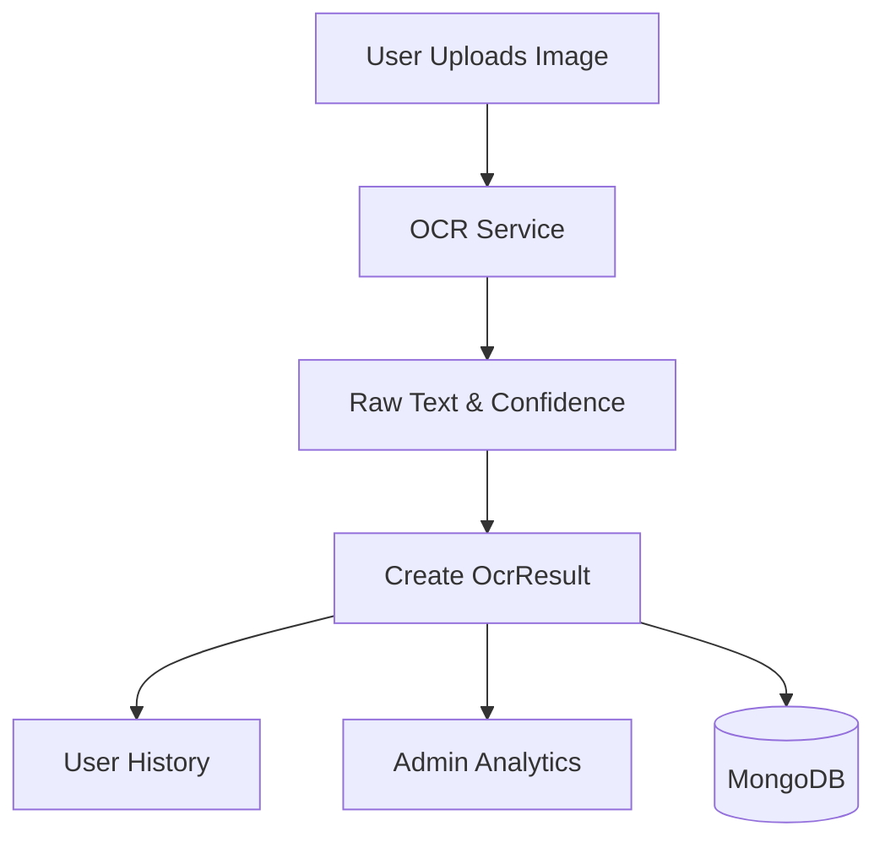

# Documentation: `models/OcrResult.js`

## Overview
This model acts as an **Audit Log and History** for every scan performed by a user. It links the raw image, the extracted text, and the final identified medicine.

## Code Block Explanation

### 1. Schema Definition
- **Links**: `userId` (Owner), `matchedMedicine` (Link to Medicine catalog).
- **Visual Evidence**: `originalImage` (URL to S3/Uploads), `processedImage`.
- **Result Data**: `extractedText`, `confidenceScore` (0-100).
- **Metadata**: `deviceInfo` (User Agent), `location` (GeoJSON), `processingTime`.
- **AI Analysis**: Nested object storing the LLM's interpretation (`identifiedMedicine`, `sideEffects`) independent of the catalog.

### 2. Indexes
Heavily indexed for analytics and history features:
- `{ userId: 1, createdAt: -1 }`: Optimizes "Show my recent scans".
- `{ medicineName: 1 }`: Analytics on most scanned medicines.
- `{ confidenceScore: -1 }`: identifying poor scans for model retraining.

### 3. Static Methods
Helper functions for common queries:
- **`getUserScans`**: Paginated history for the dashboard.
- **`getLowConfidenceScans`**: For QA/Admin review to improve OCR accuracy.

## Flowchart

## Optimization
- **Compound Indexes**: The `userId` + `createdAt` index makes loading the user history dashboard extremely fast (`O(log n)`), even with millions of records.
- **GeoJSON**: Supports location-based queries (e.g., "Where is this medicine most commonly scanned?").
