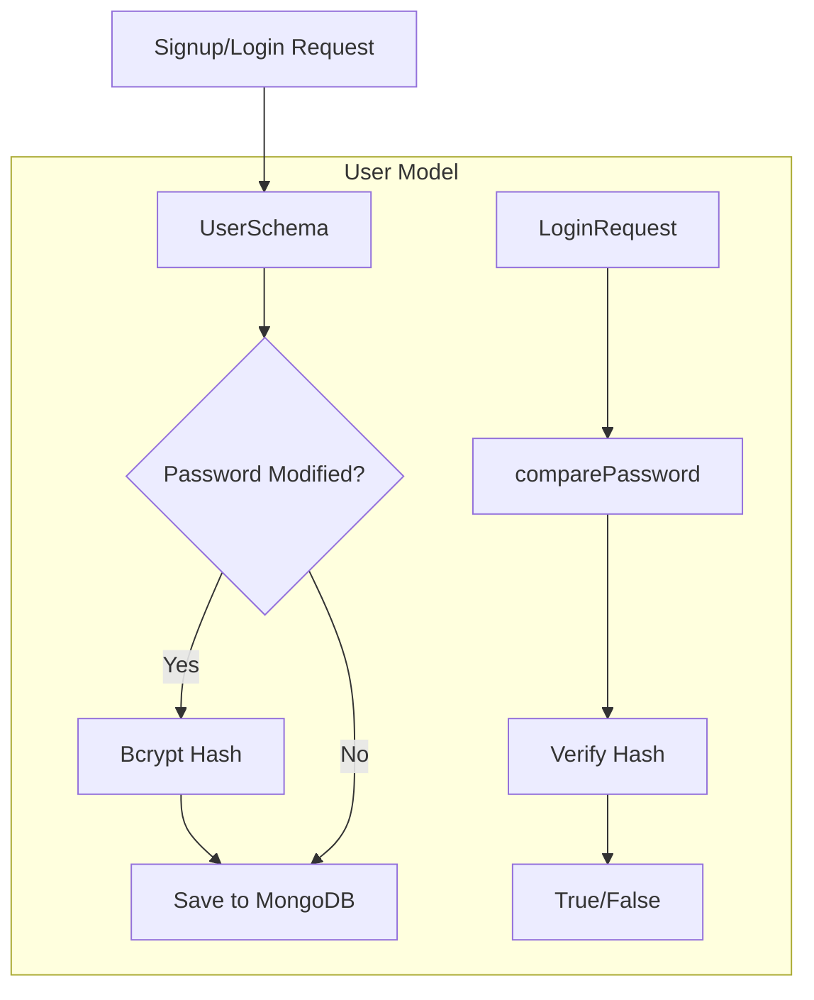

# Documentation: `models/User.js`

## Overview
This file defines the **User Schema** for MongoDB using Mongoose. It handles user identity, authentication credentials (hashed), and profile data. It acts as the backbone for the authentication system.

## Code Block Explanation

### 1. Schema Definition
The `userSchema` defines the structure of user documents:
- **Identity**: `firstName`, `lastName`, `email` (unique, indexed).
- **Security**: `password` (select: false to prevent accidental exposure), `passwordChangedAt`, `passwordResetToken`.
- **Profile**: `dateOfBirth`, `gender`, `profilePicture`.
- **Medical Profile**: `medicalConditions`, `medications`, `allergies` (arrays for storing health context).
- **Role-Based Access**: `role` ('user' or 'admin').

### 2. Middleware (`pre('save')`)
- **Purpose**: Automatic password hashing.
- **Logic**:
    - Checks `isModified('password')`.
    - If true, hashes the password using `bcrypt` with a cost factor of 12.
    - This ensures plain-text passwords are **never** stored in the database.

### 3. Instance Methods
- **`comparePassword(candidatePassword)`**:
    - Uses `bcrypt.compare` to verify login attempts.
- **`changedPasswordAfter(JWTTimestamp)`**:
    - Security feature to invalidate JWT tokens issued *before* a password change.

### 4. Virtuals
- **`fullName`**: Concatenates first and last name for easier display logic.

## Flowchart

## Optimization
- **Indexing**: `email` is implicitly indexed via `unique: true` to speed up login lookups.
- **Select False**: The `password` field is excluded from queries by default, reducing bandwidth and preventing accidental leaks in API responses.
