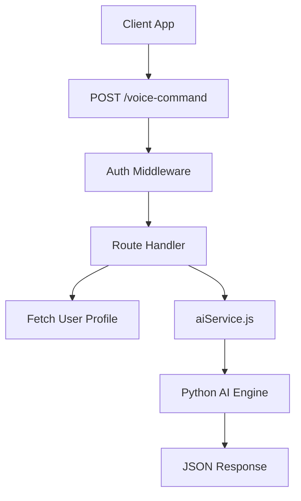

# Documentation: `routes/ai.js`

## Overview
This router handles all **Intelligence-related endpoints**. It acts as the gateway to the python-based AI engine, converting HTTP requests into internal service calls.

## Code Block Explanation

### `POST /voice-command`
- **Purpose**: Processes natural language voice commands.
- **Service Call**: `aiSystem.processComplexQuery(userId, command)`.
- **Personalization**: Fetches the user's medical profile (conditions, allergies) and passes it to the AI to ensure the response is context-aware (e.g., warning about allergens).

### `POST /medicine-analysis`
- **Purpose**: Analyzes a medicine name or OCR text.
- **Service Call**: `aiSystem.performMedicineAnalysis`.
- **Use Case**: Used when a user manually searches for a pill or after OCR has extracted text from a box.

### `POST /interaction-check`
- **Purpose**: Checks for dangerous drug-drug interactions.
- **Service Call**: `aiSystem.checkInteractions`.

### `POST /symptom-checker`
- **Purpose**: Provides initial medical triage based on symptoms.
- **Validation**: Requires at least one symptom in the array.

## Flowchart

## Optimization
- **Profile Injection**: Instead of making the AI engine query the database, the route handler fetches the user profile validation data and *pushes* it to the AI context. This reduces the complexity of the Python layer.
