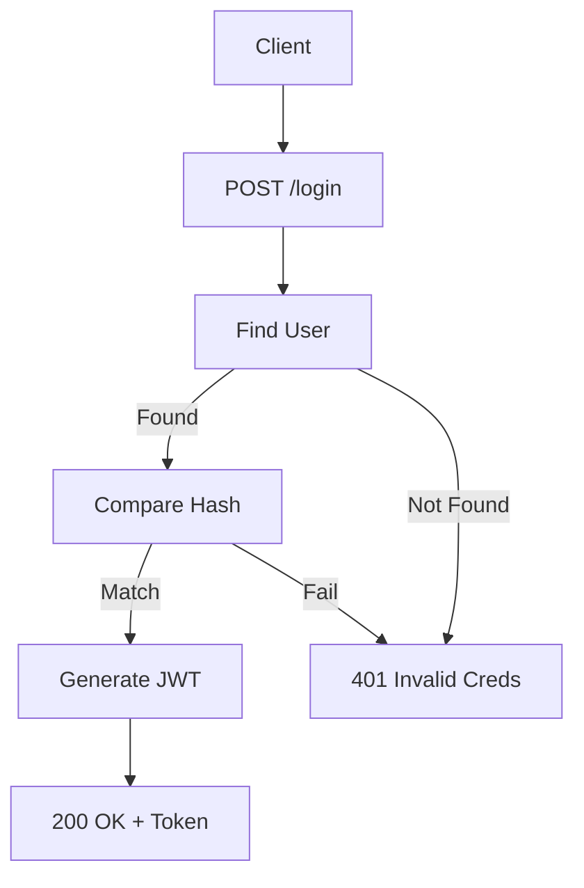

# Documentation: `routes/auth.js`

## Overview
This router handles **User Authentication and Profile Management**. It implements standard JWT-based auth flows.

## Code Block Explanation

### `POST /register`
- **Logic**:
    1.  Validates input (email format, password length).
    2.  Checks for existing email (`User.findOne`).
    3.  Creates new user.
    4.  Generates JWT Token.
    5.  Returns user data (excluding password).

### `POST /login`
- **Logic**:
    1.  Finds user by email (explicitly selecting password which is usually hidden).
    2.  Compares password hash (`user.comparePassword`).
    3.  Checks `isActive` status.
    4.  Updates `lastLoginAt`.
    5.  Returns token.

### `PUT /me`
- **Purpose**: Allows users to update their own profile.
- **Security**: Prevents users from updating sensitive fields without validation.
- **Features**: Handles email uniqueness checks if the email is being changed.

## Flowchart

## Optimization
- **`select('+password')`**: The password field is excluded by default in the Schema. The login route explicitly requests it only when needed, maximizing security for all other queries.
- **Validation**: Uses `express-validator` to sanitize inputs before they ever reach the controller logic.
