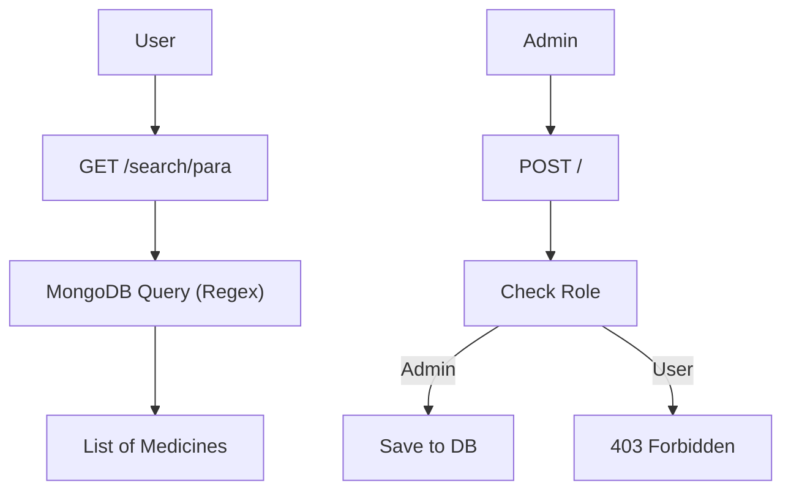

# Documentation: `routes/medicine.js`

## Overview
This router provides **CRUD operations for the Medicine Catalog**. It supports public searching and reading, but restricts creating/updating/deleting to Admins.

## Code Block Explanation

### `GET /` (List)
- **Features**:
    - **Pagination**: `page` and `limit` query params.
    - **Filtering**: `search` (regex on multiple fields), `category`.
    - **Sorting**: `sortBy` and `sortOrder`.
    - **Filter**: Defaults to `{ approved: true }`.

### `GET /search/:term`
- **Optimization**: Uses a dedicated logic to fuzzy-search medicines by name or generic name.

### `POST /` (Create)
- **Access**: `protect` + manual check for `req.user.role === 'admin'`.
- **Logic**: Creates a new medicine. Since an admin is creating it, `approved` is set to `true` by default.

### `POST /analyze-text`
- **Purpose**: A public endpoint to quickly parse text (e.g., pasted from a website) using the AI service without full OCR processing.

## Flowchart

## Optimization
- **Regex Indexing**: The search relies on MongoDB's regex capabilities. For scaling, this would move to Atlas Search or Elasticsearch, but for now, the indexed fields in the Model ensure decent performance.
