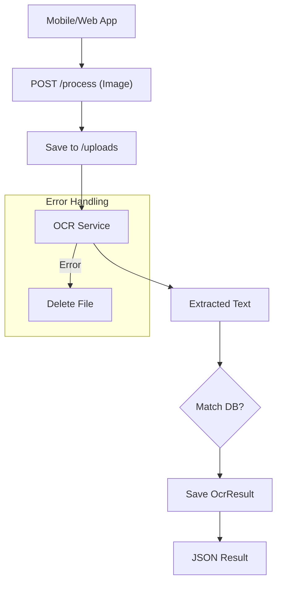

# Documentation: `routes/ocr.js`

## Overview
This router handles **Image Uploads and OCR Processing**. It uses `multer` for handling `multipart/form-data` requests.

## Code Block Explanation

### File Upload Setup (`multer`)
- **Storage**: Saves files to `uploads/` with a unique timestamp-based filename.
- **Filter**: Only accepts `image/*` mimetypes.
- **Limit**: 10MB max file size.

### `POST /process`
- **Flow**:
    1.  `upload.single('image')` middleware saves the file to disk.
    2.  `processImageWithOCR` service is called.
    3.  A new `OcrResult` document is created to log the scan.
    4.  **Auto-Match**: Tries to find if the detected text matches any known medicine in the DB.
    5.  Returns the result.
- **Error Handling**: If OCR fails, the uploaded file is deleted (`fs.unlinkSync`) to prevent storage leaks.

### `GET /history`
- **Purpose**: Returns the logged-in user's past scans.
- **Pagination**: Supports standard pagination for the dashboard UI.

## Flowchart

## Optimization
- **Cleanup**: The `fs.unlinkSync` in the catch block is crucial. Without it, failed requests would fill up the disk with orphan images.
- **Context**: Captures `deviceInfo` and `userAgent` to help debug OCR issues specific to certain cameras or platforms.
