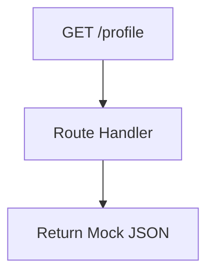

# Documentation: `routes/users.js`

## Overview
> **Note**: This file appears to be a stub/mock implementation or a legacy router. The primary user profile management is handled in `auth.js`.

This router defines basic endpoints for fetching/updating profiles and history using **mock data array** (`const users = []`).

## Code Block Explanation

### `GET /profile`
- **Current State**: Returns hardcoded mock data for `user123`.
- **Note**: In production, `auth.js` -> `/me` should be used instead.

### `POST /history`
- **Current State**: Accepts medical history entries but does not save them to MongoDB. It simply echoes back the received data with a timestamp.

## Flowchart

## Recommendation
- **Deprecation**: This file should likely be removed or merged into `auth.js` / `users.js` (controller version) in the next refactoring phase, as `auth.js` connects to the real MongoDB database.
