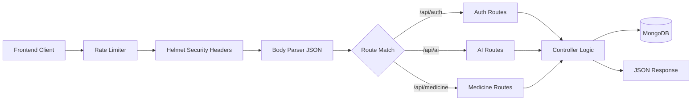

# Documentation: `server.js`

## Overview
This file serves as the **entry point** for the backend API. It initializes the Express application, configures middleware for security and performance, connects to the MongoDB database, and sets up API routes.

## Code Block Explanation

### 1. Initialization and Configuration
- **Dependencies**:
    - `express`: The web framework.
    - `cors`: Cross-Origin Resource Sharing to allow the frontend to talk to this API.
    - `helmet`: Sets various HTTP headers for security (preventing XSS, clickjacking, etc.).
    - `rate-limit`: Prevents brute-force or DoS attacks by limiting requests per IP.
    - `mongoose`: ODM for MongoDB interactions.

### 2. Database Connection (`connectDB`)
- **Logic**: Asynchronously connects to MongoDB using the URI from environment variables or a local fallback.
- **Error Handling**: Exits the process (`process.exit(1)`) if connection fails, as the API cannot function without the DB.

### 3. Middleware Pipeline
The API requests flow through these middleware in order:
1.  **Rate Limiting**: 100 requests per 15 minutes per IP.
2.  **Helmet**: Security headers.
3.  **Body Parsers**: `express.json` (limit 10mb for image uploads) and `urlencoded`.
4.  **CORS**: Allows cross-origin requests.
5.  **Static Files**: Serves the `/uploads` directory for accessed images.

### 4. Route Mounting
Mapping URL paths to route handlers:
- `/api/auth` -> Authentication logic (login/signup)
- `/api/users` -> User profile management
- `/api/medicine` -> Medicine CRUD operations
- `/api/ocr` -> Optical Character Recognition
- `/api/ai` -> AI features (wrapping the Python engine)

### 5. Error Handling
- **Global Error Handler**: Catches any unhandled errors in routes. Hides detailed stack traces in production (`NODE_ENV !== 'development'`) to prevent information leakage.
- **404 Handler**: Returns a JSON error for any unmatched routes.

## Flowchart

## How It Works & Links
- **Links**: Imports all route files from `./routes/*.js`.
- **Environment**: Relies on `.env` for `MONGO_URI` and `PORT`.
- **Execution**: Run via `node server.js` or `npm run dev`.

## Optimization
- **Rate Limiting**: Protects backend resources from abuse.
- **Body Size Limit**: The `limit: '10mb'` on JSON parsing is crucial for handling Base64 encoded images sent for OCR without crashing the server.
