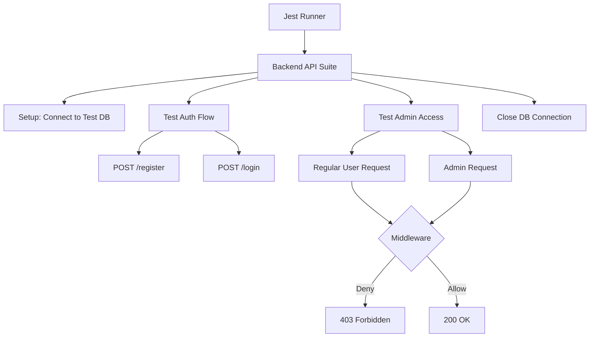

# Documentation: `tests/backend.test.js`

## Overview
This file contains the **Integration Tests** for the backend API. It uses `jest` as the test runner and `supertest` to make HTTP requests to the running Express application. The goal is to verify that all API endpoints (Auth, Medicine, OCR) function correctly before deployment.

## Code Block Explanation

### 1. Test Setup (`beforeAll`, `afterAll`)
- **Connection**: Connects to a separate **Test Database** (`mongodb://localhost:27017/test`) to ensure real user data is never touched or corrupted during testing.
- **Teardown**: Closes the database connection after all tests finish to prevent hanging processes.

### 2. Test Cases (`describe` blocks)
- **Health Check**: verifies the server is up (`/health`).
- **Auth Routes**:
    - `POST /register`: Registers a fresh user.
    - `POST /login`: Verifies credential validation and JWT token issuance.
    - `GET /me`: Verifies token decoding and profile retrieval.
- **Medicine Routes**:
    - **Role-Based Access Control (RBAC)**: Explicitly tests that a regular user receives a `403 Forbidden` when trying to create a medicine, while an admin receives `201 Created`.
- **Error Handling**:
    - Verifies that invalid inputs (e.g., empty names, bad emails) trigger `400 Bad Request`.
    - Verifies that unknown routes trigger `404 Not Found`.

### 3. Utility Functions
- **`createTestUser`**: Helper to quickly seed the DB with a user and get a valid JWT token for use in other tests.

## Flowchart

## Optimization
- **Isolation**: By using a dedicated database URL, tests can run in parallel with the development server without conflict.
- **Coverage**: The tests cover both "Happy Paths" (valid login) and "Edge Cases" (rate limiting, invalid data), ensuring robust production stability.
