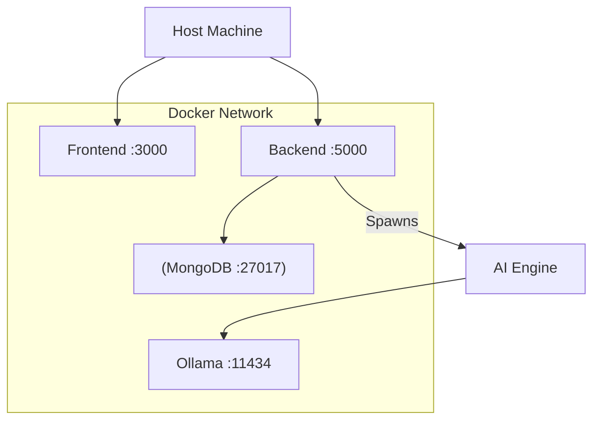

# Documentation: `devops_qa/docker/docker-compose.yml`

## Overview
This configuration file defines the **container orchestration** for the entire Medical AI Application. It allows developers to bring up the full stack (Frontend, Backend, Database, AI Engine) with a single command: `docker-compose up`.

## Code Block Explanation

### 1. Services
- **`backend`**:
    - **Build**: Uses `Dockerfile.backend`.
    - **Ports**: Maps container `5000` to host `5000`.
    - **Env**: Connects to the `mongo` service via `MONGO_URI=mongodb://mongo:27017/medical_ai`.
    - **Volumes**: Mounts `./ai_ml_engine` to allow Python script updates without rebuilding.

- **`frontend`**:
    - **Build**: Uses `Dockerfile.frontend`.
    - **Ports**: Maps container `3000` to host `3000`.
    - **Depends On**: Waits for `backend` to start.

- **`mongo`**:
    - **Image**: Official `mongo:latest`.
    - **Volumes**: `mongo_data` for persistent storage (so data isn't lost when container stops).

- **`ollama`**:
    - **Image**: `ollama/ollama:latest`.
    - **Ports**: Maps `11434` for the API.
    - **GPU Support**: Configured to use host GPU if available (via `deploy: resources: reservations: devices`).

### 2. Networks
- **`medical-net`**: A custom bridge network that allows all services to communicate using their service names (e.g., `backend` can ping `mongo`) while isolating them from the outside world (except for exposed ports).

## Flowchart

## Optimization
- **Layer Caching**: The Dockerfiles are structured to copy `package.json` before source code, maximizing build cache efficiency.
- **Volume Mounting**: Persistent volumes for MongoDB ensure zero data loss during deployments.
