# Documentation: Containerization (Dockerfiles)

## Overview
The application uses a microservices architecture containerized via Docker. We maintain two distinct Dockerfiles for independent building and scaling.

## 1. `Dockerfile.backend`
- **Base Image**: `node:18-alpine` (Lightweight Node.js runtime).
- **Key Steps**:
    1.  **System Deps**: Installs `python3`, `make`, and `g++`.
        - **Why**: The backend `aiService.js` spawns a Python child process to run `medical_ai_core.py`. Without these, the AI features would crash.
    2.  **Builder Stage**: Installs full `npm` dependencies.
    3.  **Production Stage**: Copies built artifacts and installs only production `npm` deps.
    4.  **Expose**: Port `5000`.

## 2. `Dockerfile.frontend`
- **Base Image**: `node:18-alpine` (Build Stage) -> `nginx:alpine` (Production Stage).
- **Key Steps**:
    1.  **Build**: Installs dependencies and runs `npm run build` (Vite build).
    2.  **Serve**: Uses **Nginx** high-performance web server.
    3.  **Config**: Copies custom `nginx.conf` to handle React routing (SPA fallback).
    4.  **Expose**: Port `80`.

## Flowchart: Build Pipeline

```mermaid
graph TD
    subgraph "Backend Build"
        BaseB[Node:18-alpine] --> SysDeps[Apk Add Python3]
        SysDeps --> CopyNode[Copy Backend Code]
        CopyNode --> Npm[Npm Install]
        Npm --> FinalB[Backend Image]
    end
    
    subgraph "Frontend Build"
        BaseF[Node:18-alpine] --> CopyF[Copy Source]
        CopyF --> NpmF[Npm Install]
        NpmF --> Build[Vite Build]
        
        Build --> Nginx[Nginx Alpine]
        Nginx --> CopyDist[Copy /dist]
        CopyDist --> FinalF[Frontend Image]
    end
```

