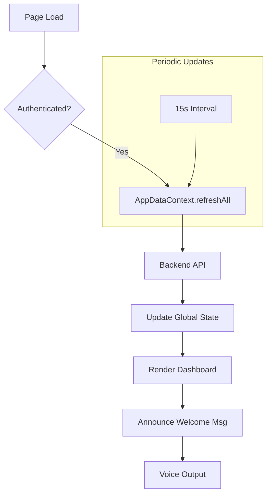

# Documentation: `HomePage.jsx`

## Overview
The **Dashboard** is the landing page for authenticated users. It is designed with a "Accessibility-First" mindset, ensuring full compatibility with Screen Readers (NVDA, JAWS) and keyboard-only navigation.

## Code Block Explanation

### Accessibility Features
- **Semantic HTML**: Uses proper `<header>`, `<section>`, `<h1>` tags.
- **ARIA Live Regions**: `
` (Lines 230-242) allows the app to announce dynamic updates (like "Welcome back") without moving the user's focus.
- **Skip Links**: A hidden "Skip to main content" link (Line 194) becomes visible on focus, allowing keyboard users to bypass proper nouns and navigation bars.
- **Focus Management**: Uses `useRef` to programmatically move focus to new sections when using keyboard shortcuts.

### Keyboard Shortcuts
The page listens for global `alt` key combinations (Lines 56-85):
- `Alt + O`: Jump to **Overview** (Stats).
- `Alt + Q`: Jump to **Quick Actions** (Scan, Reminders).
- `Alt + R`: Jump to **Upcoming Reminders**.
- `Alt + E`: Jump to **Emergency Info**.

### State Management
- `useAppData`: Consumes the global context to display real-time stats (Medicines count, Active reminders).
- `useEffect`: Refresh timer triggers `actions.refreshAll()` every 15 seconds to keep the dashboard in sync with backend updates.

## Flowchart: Dashboard Loading

## Optimization
- **`aria-live`**: Vital for blind users. Without this, visualized updates (like a loading spinner finishing) would be silent invisible to a screen reader user.
- **Memoization**: The stats calculations are memoized in the Context, so `HomePage` only re-renders when the actual numbers change.
