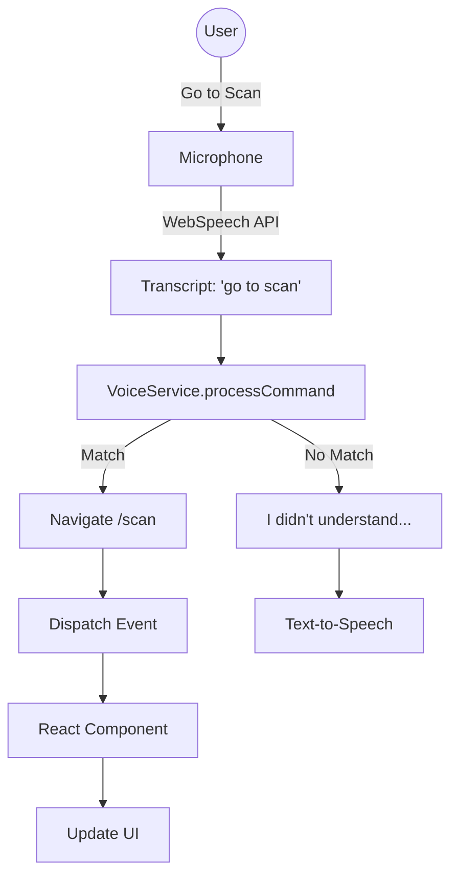

# Documentation: Frontend Services

## Overview
The frontend services manage external communications, browser APIs, and local logic to keep the React components clean and focused on UI.

## 1. `services/api.js`
- **Purpose**: A configured `axios` instance for Backend API communication.
- **Key Features**:
    - **Base URL**: `http://localhost:5000/api`
    - **Request Interceptor**: Automatically attaches the JWT `token` from `localStorage` to every request header (`Authorization: Bearer ...`).
    - **Response Interceptor**: Global 401 (Unauthorized) handler. If the token expires, it clears `localStorage` and redirects the user to `/login`.

## 2. `services/voiceService.js`
- **Purpose**: The **Core Interface** for the "Blind-Accessible" features. It manages the Web Speech API (speech-to-text and text-to-speech).
- **Architecture**: Singleton Class (`VoiceService.getInstance()`).
- **Key Methods**:
    - `startListening()`: Activates the microphone.
    - `processCommand(command)`: Uses string matching (regex-like) to map phrases like "Go to home" or "Tell me about Paracetamol" to functions.
    - `speak(text)`: Uses `speechSynthesis` to read out text.
- **Event Bus**: Dispatches custom window events (`voiceCommand`, `voiceOutput`) so React components (like `App.jsx` or `ScanPage.jsx`) can react to voice commands without tight coupling.

## 3. `services/reminderService.js`
- **Purpose**: A client-side medication reminder system.
- **Storage**: Persists data in `localStorage` (`medicationReminders`).
- **Mechanism**:
    - `startMonitoring()`: Runs a `setInterval` every 60 seconds.
    - `calculateNextDue()`: Complex logic to determine the next alarm time based on daily schedules.
    - `triggerReminder()`: Fires a Browser Notification, plays an audio alert, and speaks the reminder via `voiceService`.

## Flowchart: Voice Command Flow

