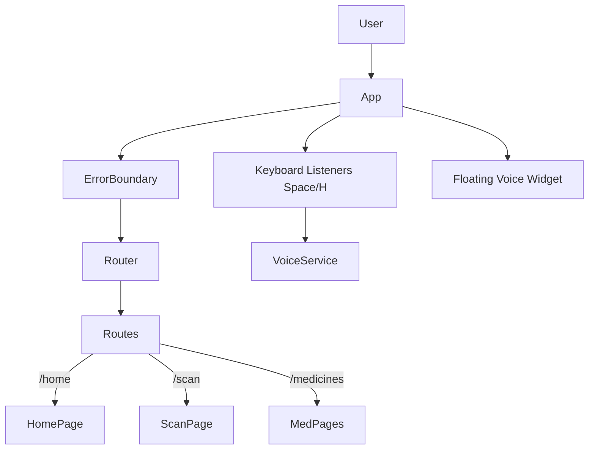

# Documentation: `src/App.jsx`

## Overview
This file is the **Root Component** of the React application. It handles client-side routing, global error boundaries, and initializes the voice control system (including global keyboard shortcuts).

## Code Block Explanation

### 1. Routing (`react-router-dom`)
Defines the navigation structure of the app:
- `/home`: Dashboard.
- `/medicines`: List of medicines.
- `/scan`: Camera/Upload interface for OCR.
- `/profile`: User settings.
- `*`: 404 Not Found fallback.

### 2. Initialization Logic (`useEffect`)
- **Voice Service**: Initializes the singleton `VoiceService` instance.
- **Keyboard Shortcuts**: Adds a global event listener to the `window`.
    - **Spacebar**: Toggles voice command listening (prevented in input fields to allow typing).
    - **H Key**: Triggers help/tutorial mode.

### 3. Layout Structure
- **Wrapper**: a `div` with `min-h-screen bg-blue-50` sets the base visual theme.
- **`ErrorBoundary`**: Wraps the entire app to catch crashes (white screen of death) and show a friendly fallback UI.
- **`VoiceControlWidget`**: Floating widget that appears on top of all pages to show listening status.

## Flowchart

## How It Works & Links
- **Links**:
    - `services/voiceService.js`: The actual logic for Web Speech API integration.
    - `pages/*`: The individual views loaded by the router.
- **Optimization**:
    - **Lazy Loading**: While currently direct imports, `Routes` allow for code-splitting in the future `React.lazy`.
    - **Event Cleanup**: The `return () => ...` in `useEffect` ensures event listeners are removed when the component unmounts, preventing memory leaks (though rare for the root App component).
