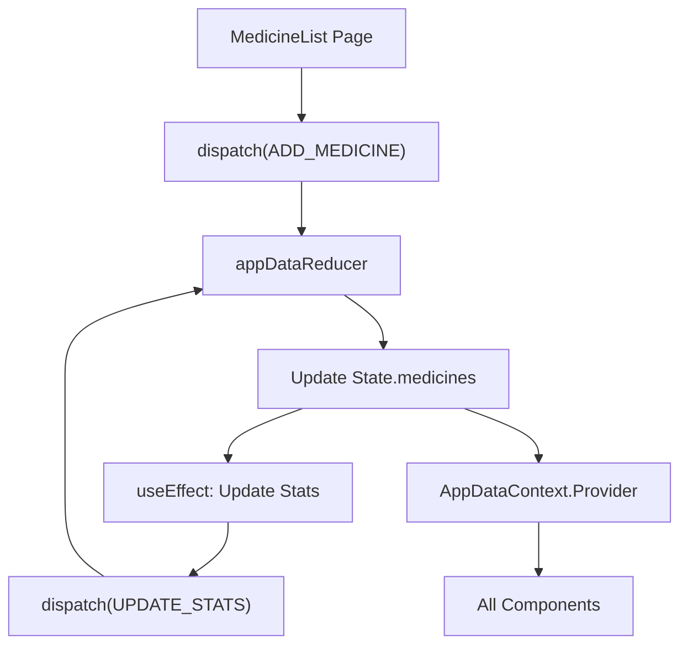

# Documentation: `src/contexts/AppDataContext.jsx`

## Overview
This file implements the **Global State Management** for the frontend using React's Context API and `useReducer` hook. It serves as a lightweight alternative to Redux, managing shared data like the medicine list, active reminders, and user profile across the entire application.

## Code Block Explanation

### 1. Initial State
Defines the default values for the application store:
- **`medicines`**: Array of medicine objects (currently seeded with dummy data like Paracetamol).
- **`reminders`**: Array of scheduled alerts.
- **`profile`**: User details.
- **`stats`**: Dashboard counters (e.g., "Active Reminders: 3").

### 2. Action Types
Constants defining all possible state transitions:
- `ADD_MEDICINE`, `REMOVE_MEDICINE`
- `MARK_AS_TAKEN`
- `UPDATE_STATS`
- `REFRESH_ALL`

### 3. Reducer Function (`appDataReducer`)
A pure function that takes the current `state` and an `action` and returns the new state.
- **Immutability**: Uses spread syntax (`...state`) to ensure state updates trigger re-renders correctly.
- **Logic**: For example, `MARK_AS_TAKEN` updates the `lastTaken` timestamp of a specific reminder without mutating the original array.

### 4. `AppDataProvider` Component
- **`useReducer`**: Initializes the state engine.
- **`useEffect` (Stats)**: Automatically recalculates dashboard statistics (e.g., counting expired meds) whenever the `medicines` or `reminders` arrays change.
- **`useEffect` (Polling)**: Sets up a 10-second interval to fetch the latest reminders from `reminderService`.
- **`useMemo`**: Wraps the `contextValue` to prevent unnecessary re-renders of consuming components (a critical performance fix).

## Flowchart

## Optimization
- **`useMemo`**: The `value={{ state, actions }}` is memoized. This ensures that the `actions` object reference doesn't change on every render, preventing an infinite update loop in dependent components (like `HomePage`).
- **Dependent Effects**: The stats calculation only runs when specific arrays change, not on every single state update (like loading state changes).
